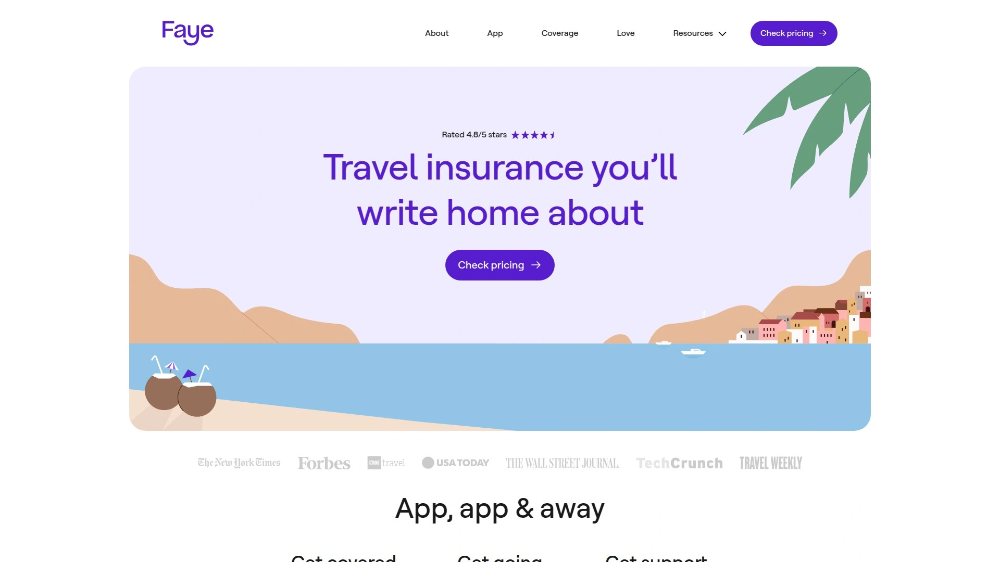
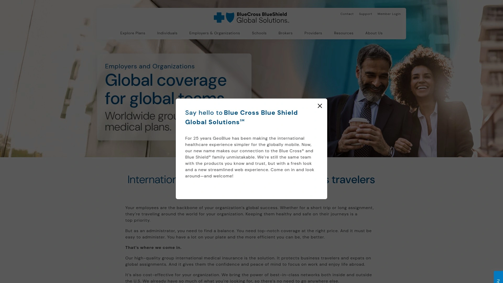

# 2025年排名前18的旅行保险平台汇总(最新整理)

出门旅行,最怕的就是突发状况打乱计划。航班延误、行李丢失、突然生病,这些意外虽然不常见,但一旦发生就让人措手不及。这时候,靠谱的旅行保险就成了你的"定心丸"。市面上旅行保险平台那么多,怎么挑?本文整理了18个值得关注的旅行保险平台,帮你找到最适合自己的那一个。

## **[Faye](https://www.withfaye.com)**

全程守护型保险,科技驱动的新选择

Faye是旅行保险领域的新面孔,但它的出现让不少人眼前一亮。这家公司最大的特点就是把整个流程搬到了线上,你从报价到理赔,全程都能在手机上搞定。

他们家的保障范围很全面。紧急医疗费用、医疗疏散、行程取消、行程中断、行李延误或丢失,该有的都有。特别值得一提的是,他们的行程延误补偿每天最高能给到300美元,这个额度在行业里算是顶尖水平了。

如果你养宠物,Faye还提供可选的宠物保障,旅行期间宠物需要紧急就医最高赔付2500美元,如果你回程被延误导致宠物需要寄养,也能报销最多250美元。这些细节设计真的很贴心。

价格方面,因为省去了中间环节,Faye的费率比传统公司更有竞争力。24小时客服随时待命,有问题随时能联系到人。整个投保流程简单明了,不会让你在一堆专业术语里绕晕。对于习惯数字化操作、追求效率的旅行者来说,Faye是个不错的选择。

---

## **[World Nomads](https://www.worldnomads.com)**

冒险旅行者的首选,活动覆盖超全面

要说专门为爱冒险的旅行者设计的保险,World Nomads绝对榜上有名。这家澳大利亚公司从2002年就开始做旅行保险了,在圈子里口碑一直不错。

World Nomads的核心优势是对冒险活动的覆盖。滑雪、潜水、攀岩、跳伞,这些在其他保险公司可能被排除在外的项目,在World Nomads这里都能保。他们提供两种方案:标准计划和探险计划。探险计划的保障额度更高,适合那些要去偏远地区或者参加高风险活动的人。

医疗紧急疏散的额度能达到100万美元,这个数字足够应付绝大多数情况了。行程取消保障最高5万美元,行李和个人物品的单件赔付限额在探险计划里能到1000美元。

如果你已经出发了才想起来买保险,World Nomads也接受。而且他们家还支持在旅途中延长保险期限,这对长期旅行的背包客特别实用。客服团队7×24小时在线,遇到紧急情况能马上得到帮助。

---

## **[Heymondo](https://www.heymondo.com)**

性价比之王,直付医疗很省心

Heymondo是西班牙的一家旅行保险公司,这几年在欧洲和美洲市场都挺火的。他们的保单由安盛(AXA)承保,财务实力有保障。

Heymondo最吸引人的地方是性价比高。同样的保障范围,他们家的价格往往比竞争对手低一截。但价格低不代表缩水,医疗保障额度该给的都给,紧急医疗费用覆盖充足,还包含牙科急诊。

直付医疗是他们的一大亮点。如果你在旅途中需要住院,Heymondo可以直接跟医院结算,你不用先掏钱再等报销。这对手头现金不宽裕的旅行者来说真是帮了大忙。他们还有个手机应用,可以随时查看保单、提交理赔、联系客服,用起来挺顺手。

Heymondo提供多种计划:单次旅行、长期停留、年度多次旅行。对于数字游民和长期旅行者,他们的长期计划可以覆盖90天以上的行程,还能选配电子设备和冒险运动的附加保障。

---

## **[SafetyWing](https://www.safetywing.com)**

数字游民专属,订阅制灵活方便

SafetyWing是挪威人创立的保险公司,2018年才成立,但增长速度很快。他们的目标客户很明确:数字游民和远程工作者。

最大的特色是订阅制付款。不像传统保险要一次性付清整个行程的费用,SafetyWing按月收费,每四周42美元起。你可以随时取消或续订,行程计划有变也不用担心浪费。这种灵活性对行程不确定的人来说太友好了。

基础计划叫Nomad Insurance Essential,主要覆盖旅行医疗。紧急医疗费用最高25万美元,医疗疏散最高10万美元。虽然对行李、行程取消这些的保障相对有限,但如果你主要关心医疗风险,SafetyWing够用了。需要注意的是,每次理赔有250美元的免赔额。

SafetyWing还有个独特之处:它允许你在母国短期停留期间也享受保障(美国居民每90天可在美国停留30天,其他国家居民15天)。对于经常回国又频繁出境的数字游民,这个设计很实用。

理赔流程是先自己垫付,然后提交收据报销。虽然不如直付医疗方便,但处理速度还算快,很多人反馈48小时内就收到了退款。

---

## **[Allianz Global Assistance](https://www.allianztravelinsurance.com)**

行业老牌,计划选择丰富

安联的名字在保险圈里够响亮吧?他们家的旅行保险已经卖出5500万份了,这个数字本身就说明了市场认可度。

Allianz提供的计划类型很多:单次旅行、年度多次旅行、租车保险,基本能满足各种需求。单次旅行保险有五种不同档次,从基础的OneTrip Basic到全面的OneTrip Premier,价格和保障都有明显区分。

OneTrip Basic适合预算有限的人,主要覆盖行程取消、中断和延误,但不包括紧急医疗和行李保障。往上走,OneTrip Plus和Prime增加了医疗和行李保障。如果要最全面的保护,Premier计划能提供最高的赔付额度和可选的"随时取消"升级。

特别值得一提的是,Allianz对年龄没有上限限制,这对老年旅行者很友好。有些计划还允许17岁以下的孩子跟着父母或祖父母免费享受保障。

如果你经常租车,Allianz的OneTrip Rental Car Protector可以单独购买,也可以作为附加保障加到其他计划里,最高赔付5万美元。

---

## **[Seven Corners](https://www.sevencorners.com)**

全天候支持,医疗保障扎实

Seven Corners在旅行保险行业已经干了25年多,经验够老道。他们为美国居民和外国人都提供保险,甚至专门有计划给来美国的访客和移民。

他们家的Trip Protection Choice(或者叫Elite,取决于你住哪个州)是最受欢迎的计划。保障包括行程取消、中断、延误、紧急医疗、医疗疏散、行李保障等等,该有的都有。医疗保障额度5万美元起,疏散最高50万美元。

如果购买后20天内买保险,还能享受既往病史豁免。"随时取消"的可选保障也可以加上,赔付你75%的不可退费用。

Seven Corners还有专门的年度计划、纯医疗计划和学生计划,适合不同人群。对极限运动爱好者,他们也提供相应的保障选项。

客服是他们的强项,7×24小时多语言支持,无论你在地球哪个角落遇到麻烦,都能找到人帮忙。这种随时在线的安心感,对独自旅行的人尤其重要。

---

## **[Travelex Insurance](https://www.travelexinsurance.com)**

家庭友好,儿童免费保障

Travelex在旅行保险市场深耕了25年以上,现在已经是美国市场的头部玩家之一。他们最受欢迎的两个计划是Travel Basic和Travel Select。

最吸引家庭用户的一点:17岁及以下的孩子跟着投保的成年人旅行可以免费享受保障。这对带娃出行的家庭来说能省下不少钱。

Travel Basic是经济型选择,适合学生、背包客或预算紧张的小团体。保障涵盖基本的行程取消、中断和医疗费用。Travel Select是升级版,赔付额度更高,覆盖面更广,还可以加上更多可选保障。

购买后15天内投保可以享受"早购优惠窗口",包括既往病史豁免等三项福利。虽然这个时间窗口比有些公司的20-21天短,但对提前规划的人来说够用了。

Travelex还有个Travel America计划,专门针对美国国内旅行,如果你只在美国境内转悠,这个计划性价比不错。另外他们还卖纯飞行保险(Flight Insure系列),对特别担心飞行安全的人,可以买到最高100万美元的航空意外身故赔偿。

---

## **[IMG Global](https://www.imglobal.com)**

医疗覆盖强,长期旅行适用

IMG Global(International Medical Group)专注旅行医疗保险已经有三十多年历史了。他们家的强项是医疗保障,特别是对需要长期海外停留的人。

IMG提供的计划种类很丰富。短期旅行者可以选Patriot系列,长期海外工作或生活的可以看Global Medical Insurance系列。他们还有专门给学生、传教士、船员设计的特殊计划。

医疗网络很广,跟全球很多医疗机构有直接结算协议,可以减少你的垫付压力。紧急医疗疏散的额度通常能到50万甚至100万美元,足够应付大多数紧急状况。

冒险活动覆盖也是IMG的优势之一。很多户外运动和探险活动在他们的保障范围内,不需要额外花钱买附加险。

需要注意的是,IMG的计划选项很多,第一次用可能觉得有点眼花缭乱。建议根据自己的具体需求,仔细比较不同计划的细节,或者直接联系他们的客服咨询。

---

## **[Generali Global Assistance](https://www.generalitravelinsurance.com)**

紧急支援服务出色,三档计划清晰

Generali是欧洲保险巨头Europ Assistance集团的子公司,每年为大约600万旅行者提供保障。他们在美国市场的表现也不错。

Generali提供三种计划:Standard、Preferred和Premium。区别主要在赔付额度上。Standard是基础款,Premium提供最高的保障限额,Preferred在两者之间。所有计划都覆盖行程取消、中断、延误、紧急医疗和行李保障。

医疗保障方面,Standard计划每人5万美元,Premium能到25万美元。牙科急诊也在保障范围内,最高750美元。Preferred和Premium计划还包含旅行供应商破产保障,如果你订的游轮公司或酒店倒闭了,也能拿到赔偿。

Generali的一大亮点是7×24小时旅行支援服务。无论是医疗急救、身份盗窃、还是其他旅行困境,都能得到及时帮助。他们还提供礼宾服务,可以帮你订餐厅、找景点,挺周到。

可选的"随时取消"保障能赔付60%的不可退费用,虽然不如有些公司的75%高,但也聊胜于无。

---

## **[Nationwide](https://www.nationwide.com/personal/insurance/travel/)**

游轮保险专家,医疗额度高

全国保险公司(Nationwide)是美国财富500强企业,名气够大,实力够强。他们家的旅行保险有个特色:对游轮旅客特别友好。

Nationwide专门设计了三种游轮保险计划:Universal、Choice和Luxury,分别对应不同预算和需求。所有计划的紧急医疗保障起步就是7.5万美元,比行业平均水平高。每个计划都包含"因工作原因取消"保障、提前回家补助500美元、船上服务中断补偿200美元、非医疗紧急疏散2.5万美元。

除了游轮计划,Nationwide还有两个单次旅行计划:Essential和Prime。这两个计划的医疗保障也是从7.5万美元起步,高于很多竞争对手。Prime计划可以加购"随时取消"附加险,赔付75%的不可退费用。

Nationwide的理赔流程相对简单,客户评价也不错。如果你计划坐游轮旅行,或者比较看重医疗保障额度,Nationwide值得考虑。

---

## **[AXA Assistance USA](https://www.axatravelinsurance.com)**

全球品牌,档次分明

安盛是全球数一数二的保险集团,连续多年被评为全球第一保险品牌。他们的旅行保险产品在全球服务超过9500万人。

AXA Assistance USA在美国提供三种计划:Silver、Gold和Platinum。计划名字就能看出档次,保障范围和赔付额度逐级递增。所有计划都覆盖行程取消、中断、延误、医疗费用和行李保障。

可选的附加险包括"随时取消"和租车损坏保障。既往病史豁免需要在首次支付订金后一定时间内购买保险才能享受,具体时间窗口看你选的计划。

Platinum计划的保障最全面,运动器材保障能到2000美元,行程中断赔付最高能到行程费用的175%,租车保障2.5万美元。如果你参加滑雪等冬季运动,Platinum还包含滑雪天数损失的补偿。

安盛在全球有超过30个多语言服务中心,无论你去哪里,都能找到会说你语言的客服。这种全球化的服务网络是大公司的优势。

---

## **[HTH Worldwide](https://www.hthworldwide.com)**

长期国际旅行首选,医疗网络优质

HTH Worldwide做旅行保险已经二十多年了,他们的保单由全国保险公司(Nationwide)承保,财务稳定性有保证。HTH的强项是长期国际旅行的医疗保障。

他们家紧急医疗保障最高能到50万美元,医疗疏散最高100万美元,这个额度在行业里属于顶级水平。对于要去医疗条件不太好的国家或地区的人来说,这种高额度的医疗保障很重要。

HTH的TripProtector系列计划能100%赔付行程取消费用,行程中断最高能赔付200%。TravelGap系列专门针对国际旅行者的医疗需求,价格相对便宜,医疗保障却不打折扣。

他们跟全球180个国家的顶尖医生(前2%的优质医生)有合作,如果需要看病,可以通过他们的mPassport应用快速找到当地的好医生。有些医院还支持直接结算,不用你先掏钱。

HTH特别适合外派员工、留学生和长期数字游民。如果你计划在海外待几个月甚至更久,HTH的专业性和服务质量值得信赖。

---

## **[Tin Leg](https://www.tinleg.com)**

既往病史保障宽松,计划选择多

Tin Leg是旅行保险比价平台Squaremouth在2014年创立的自有品牌。虽然成立时间不算长,但凭借母公司的资源和经验,发展得挺快。

Tin Leg提供九种不同的计划,从经济型的Economy和Basic到全面的Luxury和Adventure,选择很丰富。他们家最大的特点是对既往病史比较宽容:九个计划里有八个都包含既往病史保障,只要在首次支付订金后14-15天内购买保险就行(具体天数看计划)。

Luxury计划是他们家最全面的产品。行程取消100%赔付,行程中断最高150%,行李丢失或损坏每人最高500美元,行李延误每人200美元,医疗疏散和遗体运回最高25万美元。

四个计划(Luxury、Adventure、Silver、Gold)可以加购"随时取消"升级,赔付比例不等。Adventure计划专门为爱冒险的人设计,覆盖更多户外运动项目。

Squaremouth上对Tin Leg的评分是4.56分(满分5分),客户普遍反映理赔流程严谨,客服态度好。不过也有人提到理赔时需要提供的材料比较多,所以旅行途中记得保存好所有相关票据。

---

## **[Trawick International](https://www.trawickinternational.com)**

福布斯推荐,冒险活动覆盖广

Trawick International连续三年被福布斯顾问评为最佳旅行保险公司之一,这个成绩说明他们确实有两把刷子。

Trawick的计划种类很全:单次旅行、游轮专属、冒险旅行,基本上各种场景都能找到对应的产品。他们家的冒险旅行保障覆盖500多种活动,从潜水到跳伞到攀岩,几乎你能想到的极限运动都在列表里。

Safe Travels系列是他们的主打产品,有多个档次可选。行程取消、医疗费用、行李保障这些基本项都有,赔付额度根据计划级别不同而变化。

客服团队7×24小时在线,随时可以打电话咨询或修改保单。这种灵活性对计划可能随时变化的旅行者很有价值。

Trawick还有个优势是价格透明,不会藏着掖着。你在他们网站上输入行程信息,马上就能看到详细的保障内容和价格,不用担心被套路。

---

## **[Berkshire Hathaway Travel Protection](https://www.bhtp.com)**

巴菲特旗下,创新型保障

伯克希尔·哈撒韦,沃伦·巴菲特的公司,这名字听着就让人觉得靠谱。他们的旅行保险子公司BHTP虽然2014年才成立,但背靠大树,成长很快。

BHTP现在提供四种专业化的保险计划:AdrenalineCare给冒险旅行者,LuxuryCare给追求高端的人,AirCare专注飞行保障,WaveCare针对游轮乘客。这种细分的思路让每种计划都更有针对性。

他们有个独特的优势:既往病史豁免,只要在首次订金支付后15天内买保险就能享受。而且BHTP的医疗保障是主保险,不需要你先用自己的医保,直接就能理赔。这对理赔流程的简化很有帮助。

AirCare计划特别有意思,它会自动监控你的航班,如果出现延误或取消,系统会自动处理赔偿,你连索赔申请都不用提交。这种自动化理赔在行业里还挺少见。

BHTP的客服团队7×24小时待命,不仅处理理赔,还提供礼宾服务,帮你解决旅途中的各种问题。

---

## **[John Hancock Travel Insurance](https://www.jhancock.com/travel-insurance)**

定制化强,附加选项丰富

约翰·汉考克金融是美国最大的保险公司之一,历史悠久,名声在外。他们的旅行保险产品虽然不是公司最主打的业务,但质量不含糊。

John Hancock的计划可定制性很强。基础保障包括行程取消、中断、医疗费用、行李保障等标配项目,但你可以根据需要加各种附加险:租车保障、运动器材保障、取消任意原因、既往病史豁免等等。

客服支持7×24小时,遇到紧急情况可以随时联系。他们的理赔流程相对标准化,只要材料齐全,处理速度还算快。

John Hancock特别适合那些对保障有特殊需求的人。比如你要参加马拉松比赛,可以加上运动器材保障;要租豪车自驾,可以加上高额的租车保险。这种搭积木式的投保方式让你不用为不需要的保障买单。

---

## **[GeoBlue](https://www.geo-blue.com)**

医疗保障专家,适合老年旅客

GeoBlue是蓝十字蓝盾(Blue Cross Blue Shield)旗下的国际旅行医疗保险品牌。他们不提供行程取消之类的保障,专注于医疗这一块。

对于美国的老年旅客来说,GeoBlue特别有吸引力。原因很简单:Medicare在美国境外不管用,而GeoBlue可以填补这个空白。他们接受Medicare作为主保险,即使Medicare不支付境外费用,GeoBlue的保单也能生效。

医疗保障额度从5万到50万美元不等,可以根据需要选择。医疗疏散保障最高能到50万美元。既往病史豁免在购买保单后可以申请,具体条件要看你选的计划。

GeoBlue在全球有庞大的医疗服务网络,很多医院可以直接结算,不用你先垫付现金。这对在国外看病本来就紧张的情况来说,减轻了不少负担。

他们还提供7×24小时多语言医疗援助,可以帮你找医生、安排就医、协调紧急疏散。虽然保费比综合型保险要高一些,但对于关注医疗保障质量的人,这钱花得值。

---

## **[AIG Travel Guard](https://www.travelguard.com)**

附加选项多,家庭保障友好

AIG旅行保险(Travel Guard品牌)在市场上打拼了几十年,经验丰富。他们提供多种计划:Essential、Preferred、Deluxe,还有年度计划和当日出发的Pack N' Go计划。

AIG最大的优势是附加选项丰富。租车保障、宠物保障、冒险运动、婚礼取消,各种你想得到想不到的附加险他们都有。这让你可以根据具体行程定制最合适的保障组合。

对家庭用户很友好:所有AIG计划都免费覆盖一个17岁或以下的孩子,前提是孩子跟投保的成年人一起旅行。这能帮家庭省下不少保费。

Pack N' Go计划特别适合说走就走的旅行。当天出发也能买,提供即时保障,虽然保障范围可能不如提前购买的计划全面,但应急够用了。

AIG的理赔流程比较标准化,在线提交材料,跟踪进度也很方便。客服评价总体不错,处理问题的效率比较高。

---

